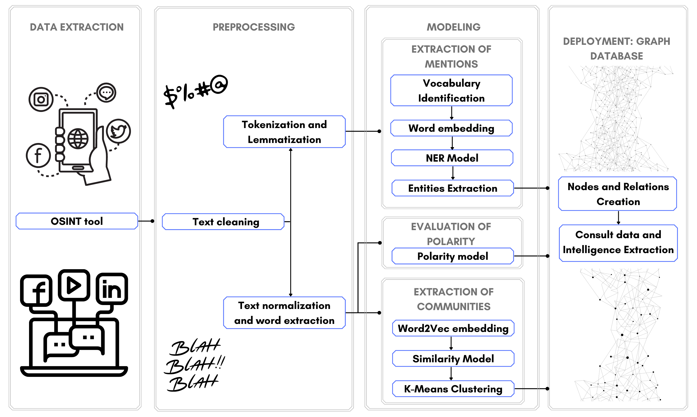

# NLP_Cybersecurity_Case

This is the repository associated to the paper "An NLP-based pipeline to spot extremist networks in social media"

# Quick Start

If you want to try the components of the architecture proposed in the paper you may refer to the following file description to identify the one that you are instested on.

Description of files included in the repository:

1. Folder "Data": It contains the inputs of the architecture.

    * Ecuador_26-27Oct2021.tsv: It contains the original 10,609 Spanish tweets collected between October 26 and October 27 2021
    * clean_text.tsv: It contains 7,796 tweets after the preprocessing phase has been applied over the collected tweets
 
 
2. Folder "NER": It contains the code used to build the NER model defined in the "modeling" phase.

    * utils.py: It contains 3 functions to:
        * Split a datset in training/testing/validation according to percents defined for each purpose.
        * Calculate the accuracy of a model
        * Train a model 
    * dataset.py: It contains the class to define a corpus and its associated methods. It uses a diccionary (NER/data/dics.pkl)
    * bilstmcrf.py: It contains the class to define a BiLSTM architecture and its associated methods
    * train.py: Orchestrator that read a dataset (NER/data/corpus.pkl), generate a training/testing/validation datasets, define the parameters of a model, optimizer and finally train the model. It uses the methods defined in utils.py, dataset.py and bilstmcrf.py

3. Folder "Preprocessing":It contains the code used to in the "preprocessing" phase.

    * utils.py: It contains 4 functions to:
        * Convert from string to date format
        * Remove URLs, mentions, hashtags and reserved words from tweets
        * Set empty values as NAN
        * Translate text from Spanish to English using Google Translate service
    * translation.py: It translates the cleaned text available in data/clean_text.tsv and store the result in data/translated_tweets.tsv
    * clean_text.py: It reads the original Spanish tweets available at data/Ecuador_26-27Oct2021.tsv, then preprocess them using the functions available in utils.py, generate a histogram for tweets published along a time serie (Img/timeserie.pdf), and store the clean tweets in /data/clean_text.tsv  
    
    
    
                

# FAQS

1. What are the requirements to run the code available in the project?

    R/ Each component (preprocessing, modeling) has special requirements. You may consult a full list of requirements in the file requirements.txt at the project root.

2. What is the architecture of the solution?

    R/ You may find the architecture and a full description of it in the paper. Here we show it as reference:
    

<figure>
    
    <figcaption>Components of the proposed NLP-based framework</figcaption>
</figure>

